 
 
 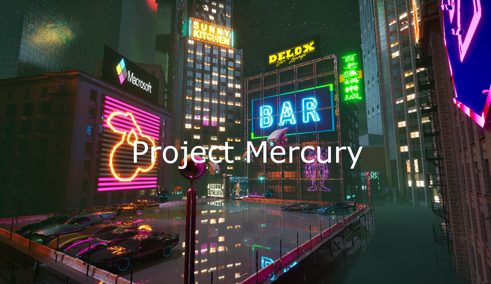

# Project Description

Project mercury is a fast paced first person shooter focused on advanced movement
that aims to make the player feel like an experienced agent. Project mercury is set in the year of 2093 and the player is tasked with retrieving valuable data from Detroit which is now inhabited by only robots.

# Project Goals

The goal of this project was to show of the skills of the 14 people on the team and display the quality we could achieve in 5 months. Personally, I worked on the developing the enemy AI. With this being my first time working in Unreal Engine I had three goals in mind. First, learn to use Unreal Engine and apply my previous experience. Second, to grow my knowledge by developing AI for a new style of game.  Third, and finally, to show off my skills as an AI developer.

# My Contributions

<!-- I created two types of enemies. This first type is a simple enemy named Boom. This enemy waits around until it detects the player. Once it does it charges them and detonates its deadly surprise. This enemy's behaviour was simple and making it was my introduction to working in Unreal.   -->

|     |  |
| --------- | ----------- |
| **Boom Agent**     • Idles until detecting the player    • Upon detection charges the player   • When close enough detonates a deadly surpise | 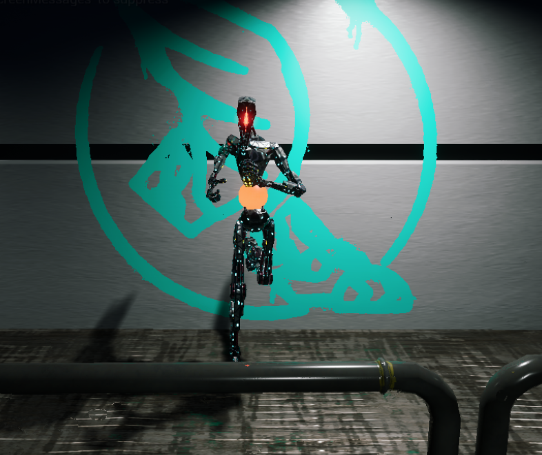     |

<!-- This next enemy type comes in three variants. This enemy type called the Patrol Agent. These enemies  are a classic guy with a gun style. Except in this case they're robots. Each variant patrols a set route until it detects the player then fires upon them with their weapon of choice. A classic assault rifle, a brutal shotgun, or a deadly sniper. Each makes decisions befitting their weapon, but all run off the same structure.  -->

|     |  |
| --------- | ----------- |
| 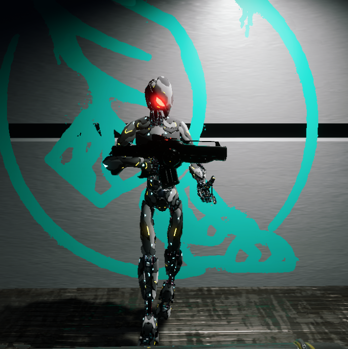    |  **Patrol Agent**     • Classic guy with a gun    • Patrols a set route   • Wields a classic assault rifle, brutal shotgun, or deadly sniper.    • Unique behaviours for each weapon. |

# Early Designing

The first step for making any enemy is figuring out what enemy you want to make. What this means for me is talking with designers and those within the enemy pod of our team. With design being an iterative process we started with verbal communication and simple behaviours. This included things such as the early behaviours of the patrol agent. It had simple enough behaviour. Patrol a set of points, investigate sound, and shoot the player if it sees them. For me this was also a chance to see how my past experience with AI and enemy development translated into Unreal Engine.

# First Implementation
<!-- 
I prefer a behaviour first approach building out the structure before implementing the functionality. So I started with a BTree its blackboard. While every agent's Btree has its own needs, the patrol variant follows the same structure. -->

|     |  |
| -------- | ----------- |
|**Patrol Behaviour Trees**     • Started with a Behaviour tree and Blackboard    • Made to be easily modifed for various weapons | 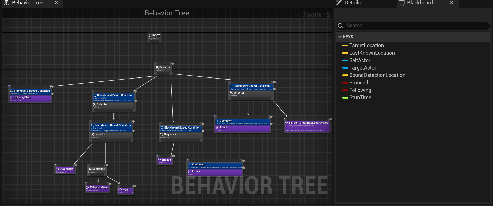     |

 <!-- The BTree and blackboard were of course followed by an AI Controller. This was followed by testing to ensure everything got called when expected. Testing here is especially important to catch bugs early before reusing the structure for other patrol agents. -->

|     |  |
| --------- | ----------- |
| 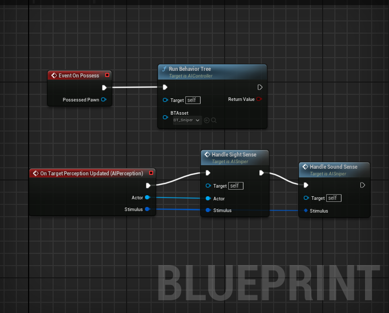    |  **Early AI Controllers**     • AI controllers to run BTrees    • Used for to test for early bugs. |

<!-- Finally, after testing is succesful, its time to implement the task functionality. This included working with our weapons programmer who provided me enemy versions of the guns which would be used by the patrol agents. Finished off with some more testing to make sure there were no immediate bugs. -->

|     |  |
| -------- | ----------- |
| **Functionality**     • Implemented after succsessful testing    • Used enemy version of the player's guns provided by the weapons programmer    • Followed by final testing before deploying | 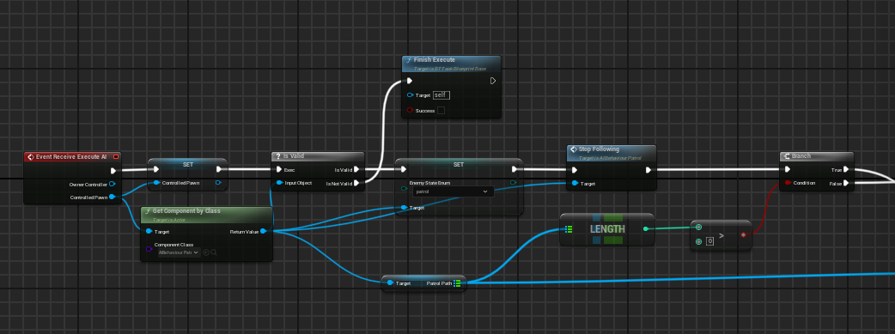     |

# Challenges

Due to their simplicity the enemies were naturally less interesting to fight. They moved and preformed as intended, but they left something to be desired. Nobody in a gun fight wants to stand in the open! So now the question becomes, how do I get an enemy to find cover?

Later as more of the players actions made produced sound for the enemies they became overwhelmed and sometimes went towards the sound stimuli instead of attacking the player.

# Final Designs

<!-- For the final design the enemy pod once again met this time creating flow charts for each enemy. With the new enemy behaviours created it was now time to address the challenges. -->

|     |  |
| -------- | ----------- |
| 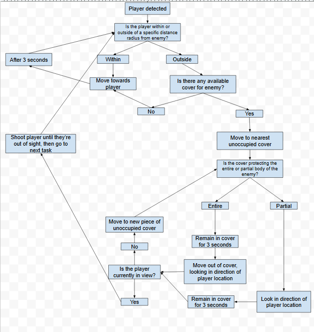    | **Final Behaviour**     • The Enemy pod had a meeting to discuss final designs    • Flow charts were used to describe the more complex behaviours   • Enemies now were required to make use of cover |

# Final Implementation

<!-- For the final implementation I began by making a BTree based off the designed behaviour flow chart. While behaviour flow charts are nice, they are not a one to one translation to implementation. I created appropriate states to accomodate the behaviour. I followed by filling out each state with the appropriate tasks. I also made an accompanying blackboard. -->

|     |  |
| -------- | ----------- |
| **New Behaviour Trees**     • Used the behaviour flow charts as a reference    • Created states to accomodate the behaviour defined by the flow chart    • Each state is filled out as needed to handle a section of the flow chart.   • New blackboards are also made to support the new behaviour trees   | 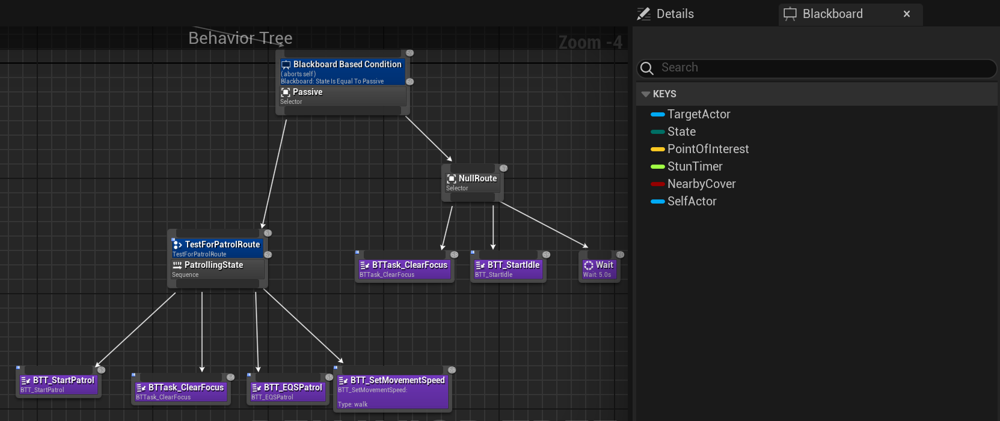     |

<!-- The new BTree also created a need to update the perception handling. Creating the new perception handling also provided the gate to stop the agent from acknowledging sound detection while already having sight of the player. This is once again followed by testing. -->

|     |  |
| -------- | ----------- |
| 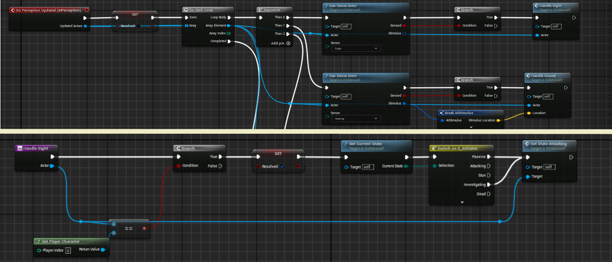    | **New AI Controllers**     • New AI Controllers are made to pair with the new behaviour trees    • Perception handling is improved to accomodate the new state based behaviour trees    • The improvements also addressed the challenge provided by sound detection    • Once again testing is preformed.  |

<!-- With the new behaviour implemented it was time to provide the enemies the ability to find cover. For this I used Unreal Engine's Environment Query system. This allowed me to quickly find strategic postions for enemies use during combat. Once the Queries were ready and tested I finished off with implementing the tasks. -->

|     |  |
| -------- | ----------- |
|  **Cover System**     • Makes use of the Environmental Query System    • Quickly finds strategic positions for enemies during combat    • More testing is preformed to ensure enemy behaviour preforms as intended  | 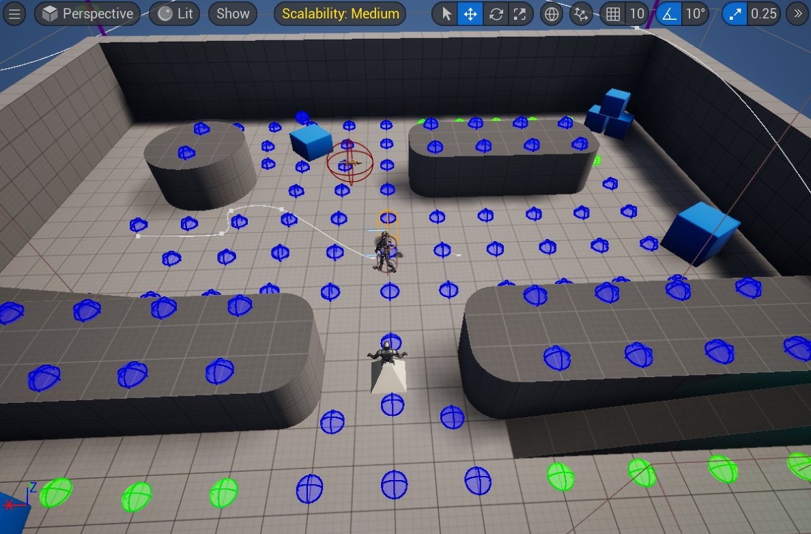     |

# Cut Content

<!-- At the beginning of the project we wanted to have a boss to finish off the level. With the boss being a big project both the other AI programmer and I worked on it. The boss was designed similarly to the rest. Starting off with a behaviour flow chart. -->

|     |  |
| -------- | ----------- |
| 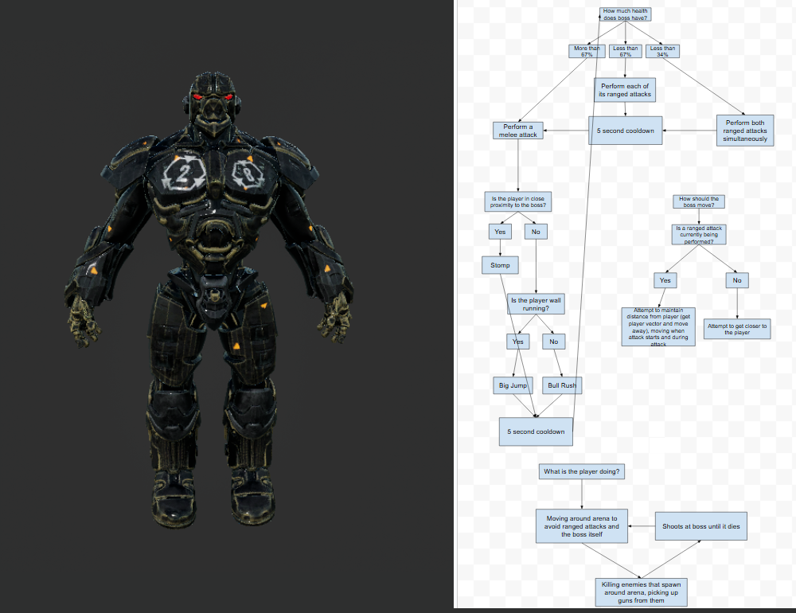    | **Boss Design**     • A boss was orignally planned    • Worked on with the other enemy programmer    • The process also began with a behaviour flow chart.   |

<!-- The flow chart was once again followed by a BTree and blackboard. We even began implementing tasks. However, as it came time to really polish the enemy we realized we certain aspects of the boss came to late. As such, we decided to cut our losses as we did not feel we had the time to bring it to the level of quality we wanted and decided against ending the level with something that did not match the quality of the rest of the game. -->

|     |  |
| -------- | ----------- |
| **Behaviour implementation**     • Behaviour tree and blackboard created using the flow chart as a reference    • Rough functionality was implemented       • Certain necessary aspects were finished too late     • Final decision was to cut the boss and not end the game with something that did not match the rest in quality  | 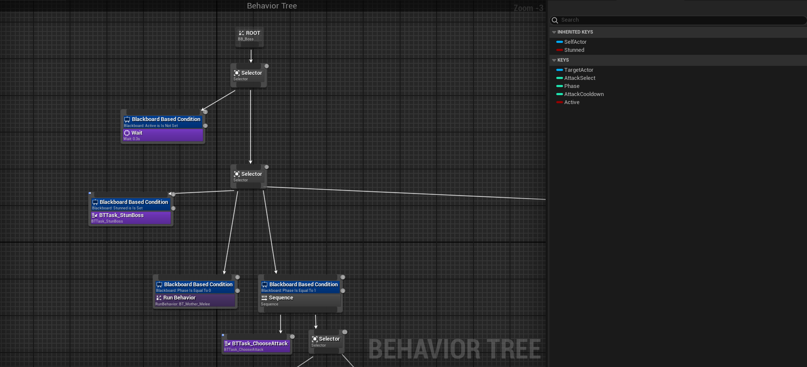     |

# What I learned

Throughout the project I learned Unreal Engine and worked with blueprint for the first time. During the early implementation our there were some troubles communicating with the enemy designer on the exact details. This was remedied by behaviour flow charts creating a middle ground between design and implementation.

I also learned that I need to fully explore any engine I'm working with as best I can before implementing code. Having a better understanding of Unreal Engine's AI systems, especially the Environmental Query System, would have helped immensely with the first implementation and saved time on the final implementation.

# Links

Email: CSOtten02@gmail.com

Itch: [itch](https://cameron-otten.itch.io/)